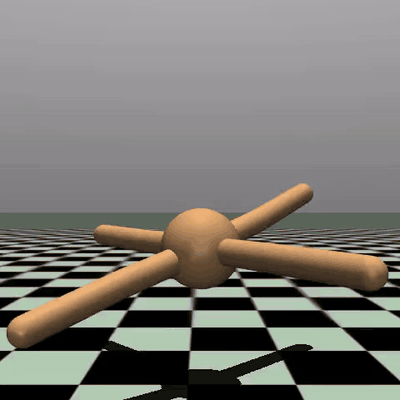

# Ant-v5 with SAC (Stable-Baselines3 + MuJoCo)

> 🚧 **Work in progress.** Functional and reproducible today; actively being polished. Expect frequent updates — issues and PRs welcome.

<p align="center">
  
</p>
<p align="center"><em>Best policy snapshot — deterministic eval at step 3,650,000.</em></p>

Trains a Soft Actor-Critic agent on the Gymnasium `Ant-v5` environment on GPU,
saves a video snapshot every 50k steps so you can watch the policy improve,
and resumes seamlessly on the next run.

## Install

```bash
python3.13 -m venv venv
source venv/bin/activate
pip install -r requirements.txt
```

> `requirements.txt` pins PyTorch 2.5.1 built against CUDA 12.1. For CPU-only or a different CUDA version, drop the `--extra-index-url` line and follow <https://pytorch.org/get-started/locally/>.

## Stack

- Python 3.13 (venv in `./venv`)
- PyTorch 2.5.1 + CUDA 12.1
- Gymnasium 1.2 with MuJoCo 3.8
- Stable-Baselines3 2.8

GPU: NVIDIA GeForce RTX 2080 (verified `torch.cuda.is_available() == True`).

## Activate the venv

Every new terminal:

```bash
source venv/bin/activate
```

## Train

Default: 750,000 env-steps, video saved every 50,000 steps.

```bash
python train.py
```

Common variants:

```bash
python train.py --steps 1_000_000        # ~2 hours on the RTX 2080
python train.py --steps 4_000_000        # ~overnight (~8 hours)
python train.py --video-every 25_000     # finer-grained video progression
python train.py --video-every 0          # disable video recording entirely
python train.py --help                   # all options
```

The script saves `ant_sac.zip` and `ant_buffer.pkl` on exit (including Ctrl-C),
so interrupting is always safe.

## Resume

Just re-run `train.py`. If `ant_sac.zip` exists, it loads the model and the
replay buffer and continues with `reset_num_timesteps=False`, so the
TensorBoard x-axis stays continuous across runs.

```bash
python train.py                       # auto-resumes if ant_sac.zip is present
python train.py --steps 4_000_000     # e.g. overnight run that picks up where you left off
```

To start fresh, delete the checkpoint:

```bash
rm ant_sac.zip ant_buffer.pkl
rm -rf ant_tb videos                  # also clears logs and videos
```

## Watch the trained policy live

Pops up a MuJoCo window and runs 5 deterministic episodes:

```bash
python watch.py
```

## Watch progress over time (videos)

Every `--video-every` steps, `train.py` rolls one greedy eval episode and writes
an MP4 to `./videos/`, named by global step:

```
videos/eval_step_000050000.mp4
videos/eval_step_000100000.mp4
videos/eval_step_000150000.mp4
...
```

Open the folder in your file manager and play them in order to literally see
the ant evolve from random flailing into a smooth trot.

## TensorBoard

In a second terminal:

```bash
source venv/bin/activate
tensorboard --logdir ./ant_tb/
```

Then open <http://localhost:6006>. Key metrics:

| Tag                       | What it means                                          |
| ------------------------- | ------------------------------------------------------ |
| `rollout/ep_rew_mean`     | average episode return — this is the headline curve    |
| `rollout/ep_len_mean`     | episode length; rises to 1000 as the ant stops falling |
| `eval/mean_reward`        | return of the deterministic eval episode (per video)   |
| `train/actor_loss`        | SAC actor loss                                         |
| `train/critic_loss`       | SAC critic (Q) loss                                    |
| `train/ent_coef`          | auto-tuned entropy temperature α                       |

## What to expect (SAC on Ant-v5)

| Steps      | Behavior                                                  |
| ---------- | --------------------------------------------------------- |
| 0 - 50k    | Random flailing, falls over constantly. Returns near 0.   |
| 50k - 150k | Learns to stand, then awkward shuffling. Returns 500-1500.|
| 150k - 300k| A recognizable trot emerges. Returns 2000-3500.           |
| 300k - 500k| Smooth gait. Returns 3500-5500.                           |
| 1M+        | "Solved" territory (~6000+).                              |

## Files

| File                  | Purpose                                                       |
| --------------------- | ------------------------------------------------------------- |
| `train.py`            | train / resume SAC on Ant-v5, record eval videos              |
| `watch.py`            | render the best policy in a window                            |
| `ant_sac.zip`         | **latest** checkpoint — used to resume training               |
| `ant_sac_best.zip`    | **best-ever** eval policy — used by `watch.py`                |
| `ant_sac_best.txt`    | sidecar: the eval reward of the best policy (for resume safety) |
| `ant_buffer.pkl`      | saved replay buffer (created on first run, ~1.7 GB)           |
| `ant_tb/`             | TensorBoard logs (see `eval/best_mean_reward` for high-water mark) |
| `videos/`             | one MP4 per eval snapshot                                     |

### Two checkpoints, one workflow

RL policies can briefly degrade late in training (catastrophic forgetting / temporary regression). To protect against losing a good policy:

- `ant_sac.zip` is **always overwritten** with the latest model — this is what `train.py` reads to resume.
- `ant_sac_best.zip` is **only overwritten when an eval beats the previous best** — this is what `watch.py` loads. The high-water mark survives across runs via `ant_sac_best.txt`.

So a resumed run that goes worse won't lose you anything: you can still `python watch.py` your best-ever ant, and you can keep training from the most recent state.
